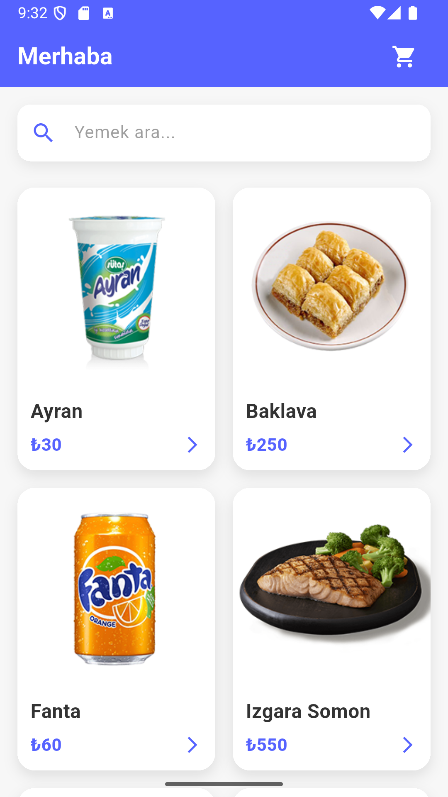

# 🍔 Flutter Yemek Sipariş Uygulaması (Cubit Mimarisi)

Bu proje, Flutter kullanılarak geliştirilmiş, modern ve kullanıcı dostu bir yemek sipariş mobil uygulamasıdır. Uygulamanın temel amacı, temiz kod yapısını koruyarak **BLoC/Cubit** state yönetim deseniyle dinamik veri akışını yönetmektir.

## ✨ Temel Özellikler

* **Dinamik Yemek Listeleme:** Ana sayfada API üzerinden tüm yemeklerin listelenmesi.
* **Arama Fonksiyonu:** Kullanıcıların listedeki ürünleri kolayca bulabilmesi için arama alanı.
* **Detay Sayfası:** Ürün detaylarını, fiyat bilgilerini (eski/yeni), teslimat süresini ve adet seçeneğini sunan modern arayüz.
* **Sepet Yönetimi (Cubit):** Sepete ürün ekleme, sepet içeriğini listeleme ve sepetten ürün silme işlemleri.
* **Sipariş Onayı:** Sepet onayında görsel geri bildirim (GIF'li Alert Dialog).
* **State Yönetimi:** Proje genelinde **Flutter BLoC/Cubit** deseni kullanılarak durum yönetiminin ayrılması.

## 🛠️ Kullanılan Teknolojiler

* **Dil:** Dart
* **Framework:** Flutter
* **State Yönetimi:** `flutter_bloc` / Cubit
* **HTTP İsteği:** `Dio` paketi
* **Mimarisi:** Repository Pattern ile MVVM benzeri bir yapı.

## 📁 Proje Yapısı

Proje, temiz ve katmanlı bir mimariyi takip eder:
lib/ 
├── data/ 
│ ├── entity/ 
# Model sınıfları (Yemekler, SepetYemekler, Cevaplar) 
│ └── repo/ 
# API ile iletişim kuran Repository sınıfları (YemeklerDaoRepository) 
├── ui/ │ 
├── cubit/ 
# Uygulamanın iş mantığını içeren Cubit sınıfları │ 
├── views/ 
# Kullanıcı arayüzü (Anasayfa, YemekDetay, SepetSayfa) 
│ └── main.dart

## ⚙️ Kurulum ve Çalıştırma

Projeyi yerel makinenizde çalıştırmak için aşağıdaki adımları izleyin:

1.  **Projeyi Klonlayın:**
    ```bash
    git clone [https://github.com/KULLANICIADINIZ/REPO-ADI.git](https://github.com/KULLANICIADINIZ/REPO-ADI.git)
    cd REPO-ADI
    ```

2.  **Bağımlılıkları Yükleyin:**
    ```bash
    flutter pub get
    ```

3.  **Assets Kontrolü:**
    * `pubspec.yaml` dosyasında `assets/` klasörünün tanımlı olduğundan emin olun.
    * Örnek GIF'i (`siparis_basarili.gif`) `assets` klasörüne eklemeyi unutmayın.

4.  **Uygulamayı Başlatın:**
    ```bash
    flutter run
    ```

## 🖼️ Ekran Görüntüleri

| Anasayfa | Detay Sayfası | Sepet Sayfası |
| :---: | :---: | :---: |
|  |  |  |

---
**Geliştirici:** Batuhan Yılmaz
